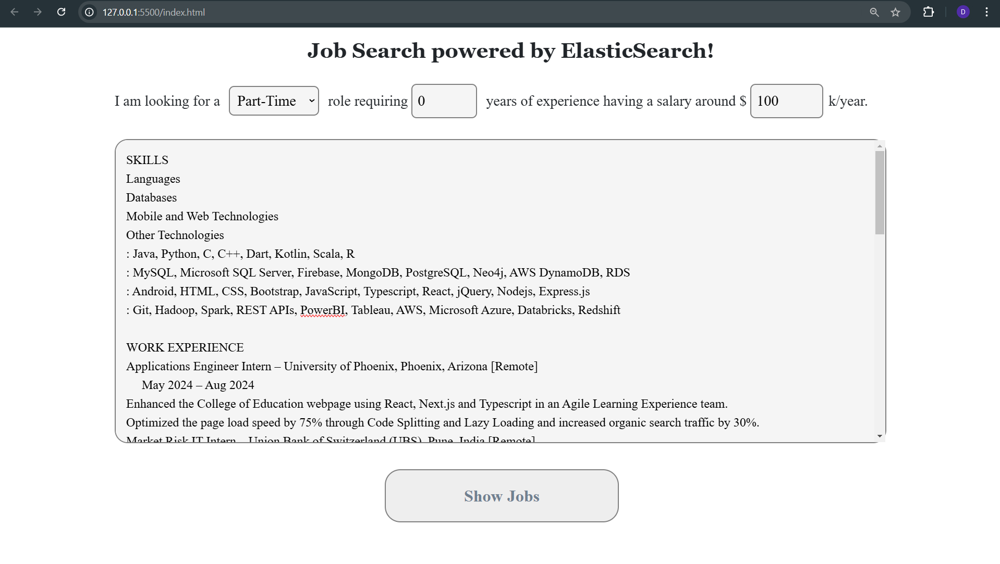
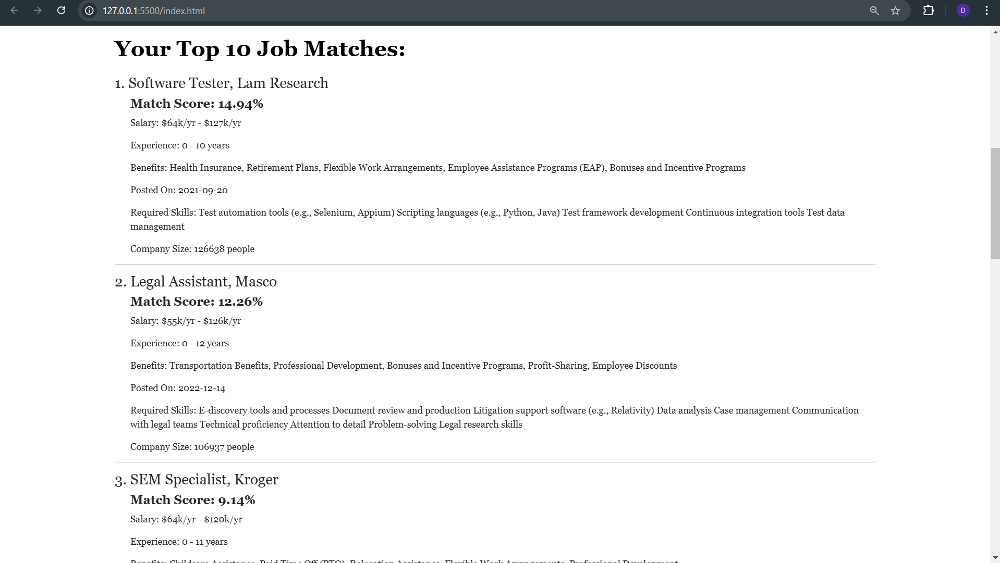

# Job Search Powered by Elasticsearch
A full-stack Elasticsearch application for Job Search!

This tool enables users to upload their resumes and discover the top 10 job opportunities that best match their qualifications and preferences. Powered by a comprehensive dataset of over 7,500 job postings across diverse industries, the system tailors job recommendations to the user's unique profile. Users can further refine their search by specifying their experience, preferred salary range, and desired job type. Each job listing is accompanied by a personalized match score, offering insights into how well the opportunity aligns with the user's skills and aspirations. This empowers users to confidently apply for roles that best suit their career goals.

<h2 style="font-size: 16px;">Steps to run the application</h2>
1. Clone this repository
2. Run ElasticSearch and Kibana locally.
3. Run upload_data.py to add the dataset to the Elasticsearch index
4. Open the terminal and run backend.py
5. Open the index.html file in the browser and to run the application!